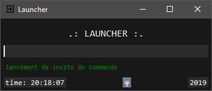

## Description
Launcher vous permet de lancer vos applications et vos
sites web avec vos propre mots clés que vous pouvez personnaliser et configurer 
facilements

---

## Télécharger
[Launcher.exe](https://github.com/quentinhouillon/launcher/releases/download/2.0/Launcher.-.Setup.exe)

## Développement
- Python 3.6
- Tkinter (GUI)
- Json

## Outils utilisés
- Visual Studio Code

## Plateforme
- Windows

## License
- Tous droits réservés

## Auteur
- w4rmux
- [GitHub](https://github.com/quentinhouillon/)
- [Site](https://quentinhouillon.github.io/w4rmux/)

