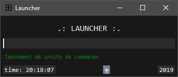

## Description
'Launcher' vous permet de lancer vos applications et vos
sites web avec vos propre mots-clés que vous pouvez personnaliser et configurer 
facilement.

---

## Mis a jour 2.3
- modification du dossier 'shortcuts': maintenant dans le dossier des
  configurations 'file'.

- plus besoin de taper 'open' il y a maintenant un bouton 'ajouter' dans la
  fenêtre 'add'.

## Téléchargement
[Launcher.exe](https://github.com/quentinhouillon/launcher/releases/download/2.3/Launcher-Setup.exe)

## Développement
- Python 3.6
- Tkinter (GUI)
- Json

## Outils utilisés
- Visual Studio Code

## Plateforme
- Windows

## License
- Tous droits réservés

## Auteur
- w4rmux
- [GitHub](https://github.com/quentinhouillon/)
- [Site](https://quentinhouillon.github.io/w4rmux/)

